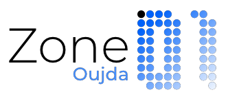

# Zone01



Welcome to the **Zone01 Project** repository! 🚀 This repository contains all my work from the **Zone01 Oujda Pool**. It includes exercises and challenges implemented in **Go** as I explore and master the basics of DevOps and software engineering.

---

## Description

Zone01 Pool is an opportunity for programmers to hone their skills through structured challenges. This repository contains **my original code** written in Go as part of the program. It showcases a week-long journey of learning and applying **DevOps fundamentals**.

---

## GO


---

## Table of Contents

1. [Project Description](#project-description)
2. [Features](#features)
3. [Prerequisites](#prerequisites)
4. [Installation](#installation)
5. [Usage](#usage)
6. [Examples](#examples)
7. [Contributing](#contributing)
8. [License](#license)
9. [Contact](#contact)

---

## Project Description

**Zone01** is a collection of programming exercises and quests designed to enhance problem-solving skills and mastery of the Go programming language. This repository is part of my journey during a week-long program at **Zone01 Oujda** focused on **DevOps fundamentals**.

---

## Features

- **Quads Generator**: Generate ASCII-based visualizations using custom algorithms.
- **Error-Free Implementation**: Clean and robust Go code.
- **Open Source**: Shareable and modifiable for learning and enhancement.

---

## Prerequisites

- **Go Language**: Version 1.17 or later.
- A basic understanding of **command-line operations**.

---

## Installation

- Clone the repository using the following command:

	```bash
	git clone https://github.com/oussama-fa/Zone01.git
	cd Zone01
